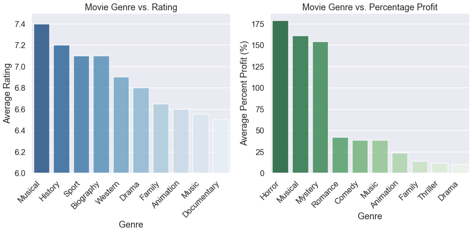

# Getting Started in the Movie Industry

**Author:** Jonathan Lee
***

<a href="https://www.vecteezy.com/free-vector/dvd">Dvd Vectors by Vecteezy</a>

## Overview

This analysis focuses on an exploration of data tables from IMDB and The Numbers. We will walk through high-level exploratory data analysis to preview what data we have to work with, data cleansing to ensure that our data is accurate, feature engineering to calculate useful metric based on the provided data and visualization to effectively explain what aspects of film-making Microsoft should focus on as it embarks on a journey to find success in the film industry. The results from this analysis show that overall, Musicals tend to perform well, but of course there are multiple other factors to keep in consideration.

## Business Problem

Microsoft sees all the big companies creating original video content and they want to get in on the fun. They have decided to create a new movie studio, but they don’t know anything about creating movies. The goal of this analysis is to explore what types of films are currently doing the best at the box office and translate those findings into actionable insights that the head of Microsoft's new movie studio can use to help decide what type of films to create. For this analysis, we will focus on the following questions:

1. What genres of movie are likely to succeed?
2. What genres cost more to produce?
3. How does production budget affect the success of a movie?

## Data Understanding

In this analysis, we will be exploring datasets from IMDB and The Numbers. We can obtain information regarding movie titles, release years, genres, budget, and ratings from IMDB, and financial data from The Numbers.

To create an optimal basis for analysis, we will restrict movie releases from 2015 to 2019. Because movie preferences change with social context over generations, this will ensure that we have a dataset of movies that are relevant in this time period. By setting an upper limit for movie releases at 2019, we also eliminate any unusual data that has been impacted by COVID-19 restrictions. It is safe to make this assumption, since we are seeing more states open up restrictions with the decline of COVID-19 cases.

We will also be focusing on financial information within the US, since it would be best for a new film studio to focus on a specific audience as opposed to a worldwide audience.

## Data Modeling

We have thoroughly prepared our data for visualization, and we can now return to our three questions for analysis:

1. What genres of movie are likely to succeed?
2. What genres cost more to produce?
3. How does production budget affect the success of a movie?

We will now proceed to plot our data to help us get a better sense of how each of these criteria translate to a movie's success.

### Genre vs. Movie Success

To examine which genres have the highest KPIs, we will use bar plots. This enables us to clearly see the aggregate median values for each of our genres.

    

### Genre vs. Production Costs

To examine which genres have the highest mean production costs, we will use bar plots. This plot will indicate clearly which genres on average cost the most to produce.

    

    

### Production Budget vs. Percentage Profit

Now that we have an idea of the impact of genre choice, we can begin to look at how production budget affects movie success. 

    

    

### Production Budget vs. Movie Success

We can see above that due to extreme outliers, our regression plot is distorted, showing a large cluster of points below 2,000% profit. Hence, we will restrict the y-axis to more clearly show our data points and regression line. 

In this situation, it is appropriate to use a regression plot to display a marker for each of our movies, showing the relationship between each movie's production budget and its respective KPI.

    

    

## Evaluation

### 1. What genres of movie are likely to succeed?

Our bar plot indicates that Musicals have a tendency to receive higher ratings with non-fictional genres including History, Biography and Sports following closely behind. 

However, the most profitable genres by far appear to be Horror, Musicals, and Mystery.

The Musical genre appears to be a top performer in both cases, but otherwise, genre choice will depend on whether Microsoft's goal is to build a reputation for building good movies, or if it is purely to maximize profits in the most efficient use of its budget.

### 2. What genres cost the most and least to produce?

Musicals are by far the most costly genre of movie to produce, followed by Fantasy, Sci-Fi and Adventure. The lowest costing genres are War, Horror and Mystery.

### 3. How does production budget affect the success of a movie?

We can see in our regression plot that as production budget increases, there is a positive trend in average rating. Conversely, we can see that profit percentages tend to decrease with larger budget movies.

In this case, it is important to note that the margin of error is skewed on the extremes of the budget. There are a much higher number of samples that are low budget, and fewer samples that are high budget. 

Therefore, we can tell that a **higher budget is more likely to receive a higher rating, while likely to return a lower profit percentage**, but movie budget is not a definitive indicator of how successful a movie will be.

This plot gives us enough information now to make a conclusion on what Microsoft should keep in mind when creating its first films.

## Conclusions

There is no clear-cut formula to creating a successful movie, and there will always be exceptions, even though a certain movie might not seem to fit criteria that have had a track record of success.

Horror and Mystery movies only require a low production budget, but have a track record of receiving high profit percentages. If profit percentage is a priority for Microsoft, either of these genres would be a good pick.

However, with the above analysis, we can see that although Musicals cost the most to produce, they do have a tendency to perform well as opposed to other genres. More specifically, Musicals were likely to receive better ratings, as well as have a higher profit percentage.

Under the assumption that production budget is not a major concern for Microsoft, we can conclude that it would be a safe choice to create movies under the Musical genre, despite the slightly negative correlation between production budget and profit percentage. By focusing on receiving higher ratings, Microsoft would be able to earn a strong reputation within the film industry, allowing it to more effectively market its future productions.

Some questions to consider for further analysis include the following:

1. What would be the most efficient allocation of production budget between cast, directors and writers and does how does this apply to the most successful genres? This would include an analysis of how much impact each of these roles tend to have on a genre’s success.
2. Does the provided analysis apply when considering worldwide gross as opposed to just domestic gross? Although it would be best to start off focusing on a smaller audience, it could be in Microsoft's best interest to eventually increase production to a worldwide scale.

## Appendix

### Runtime vs. Movie Success

Another potentially useful metric to keep in mind is the movie runtime. This was not included as a main part of the analysis, since it is not as closely related to the other questions of analysis which dealt more with the impact of genre selection. 

However, there does seem to be some correlation between runtime and production budget. As we increase both budget and runtime, they both tend to result in a higher rating but a lower profit percentage. It is also intuitive that longer movies cost more to produce due to the amount of additional editing time and wages that would need to be paid.

#### Runtime vs Movie Success

To identify the relationship between runtime and movie success, we have used a regression plot to display a marker for each of the movies with an appropriate regression line for each KPI.

    

    

